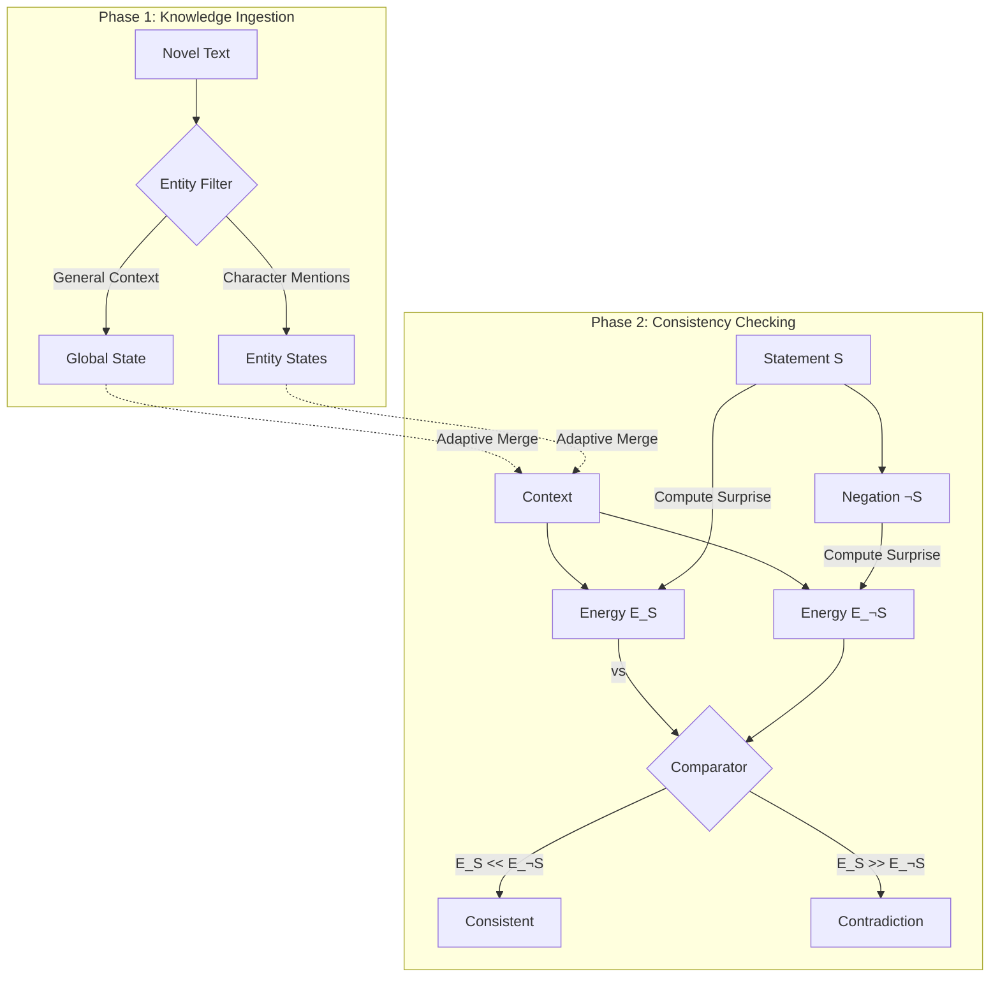

# Narrative Consistency System

A retrieval-augmented, energy-based architecture for detecting plot contradictions in long-form narratives. This system leverages **Entity-Aware World Modeling** and **Contrastive Energy** checks to identify when new statements contradict established backstory.

## Overview

The goal of this system is to maintain a consistent "World State" for a narrative universe. As new text (novels, chapters) is ingested, the system updates its internal representation of the world and its characters. When new statements are proposed, the system evaluates their consistency against this world state using an energy-based metric.

## Architecture



The system is built on three core pillars:

### 1. Entity-Aware World State
Standard language models often entangle facts into a single global state. This architecture maintains:
- **Global State**: Captures general narrative context and timeline.
- **Entity States**: Dedicated `BDH` (Baby Dragon Hatchling) neural states for each character.
- **Adaptive Merging**: A learned mechanism that dynamically combines the Global State and relevant Entity State based on the query.

### 2. Pure Infinite Context (BDH)
Instead of a fixed context window, the system uses the **Baby Dragon Hatchling (BDH)** architecture. BDH is a scale-free, state-space model that allows for effectively infinite context retention by maintaining a compressed, evolving neural state rather than storing all past tokens.

### 3. Contrastive Energy-Based Consistency
To detect contradictions, we avoid simple binary classification. Instead, we use a **Counterfactual Energy** approach:
1. **Statement $S$**: "Alice was in Paris."
2. **Negation $\neg S$**: "Alice was NOT in Paris."
3. **Surprise (Energy) Calculation**: The system computes how "surprised" the World State is by both $S$ and $\neg S$.
4. **Logic**:
   - If $E(S) \gg E(\neg S)$, the statement contradicts the backstory.
   - If $E(S) \ll E(\neg S)$, the statement is consistent.

## System Components

The codebase is modularized into the `narrative_system` package:

- **`system.py`**: The central controller (`NarrativeConsistencySystem`) that orchestrates components.
- **`world_state.py`**: Defines the `WorldState` data structure and the `AdaptiveMerge` mechanism.
- **`ingestion.py`**: Handles the reading of novels and the routing of text to update specific Entity States (`_entity_aware_ingest`).
- **`models.py`**: Contains the `CoherenceClassifier` and `HybridCoherenceClassifier` definitions.
- **`inference.py`**: Logic for predicting consistency scores (`predict_single`).
- **`training.py`**: Routines for supervising the classifier using known contradictions.


## Setup & Models

Before running the system, you must ensure the pre-trained checkpoints are available.

1.  **Create Directory**: Ensure a `models/` folder exists in the project root.
2.  **Download Checkpoints**: Download the required files from this [Google Drive Link](https://drive.google.com/drive/folders/1E1iVPSH7ELFddX09CXfL-9kJIpe6VoTc?usp=sharing) and place them in `models/`:
    - `narrative_consistency.pt`
    - `bdh_base.pt`
    - `world_state_cache.pt` (if available)

## Installation

```bash
pip install -r requirements.txt
```

## Usage

The system is controlled via `main.py`.

### 1. Training
Trains the coherence classifier to distinguish consistency based on the ingested world state.
```bash
python main.py --train --epochs 5 --data_dir ./files
```

### 2. Testing / Inference
Generates predictions for a CSV of statements.
```bash
python main.py --test --data_dir ./files
```

### 3. Interactive Mode
Query the system manually to check specific facts.
```bash
python main.py --interactive
```

### 4. Verification
Runs an internal pipeline check.
```bash
python main.py --verify
```
